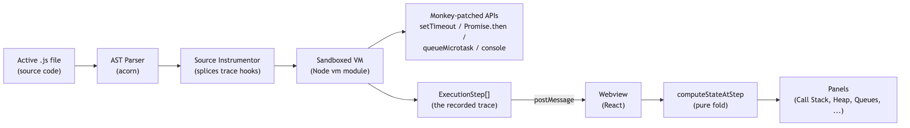
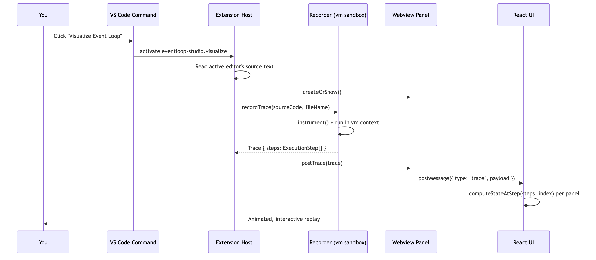
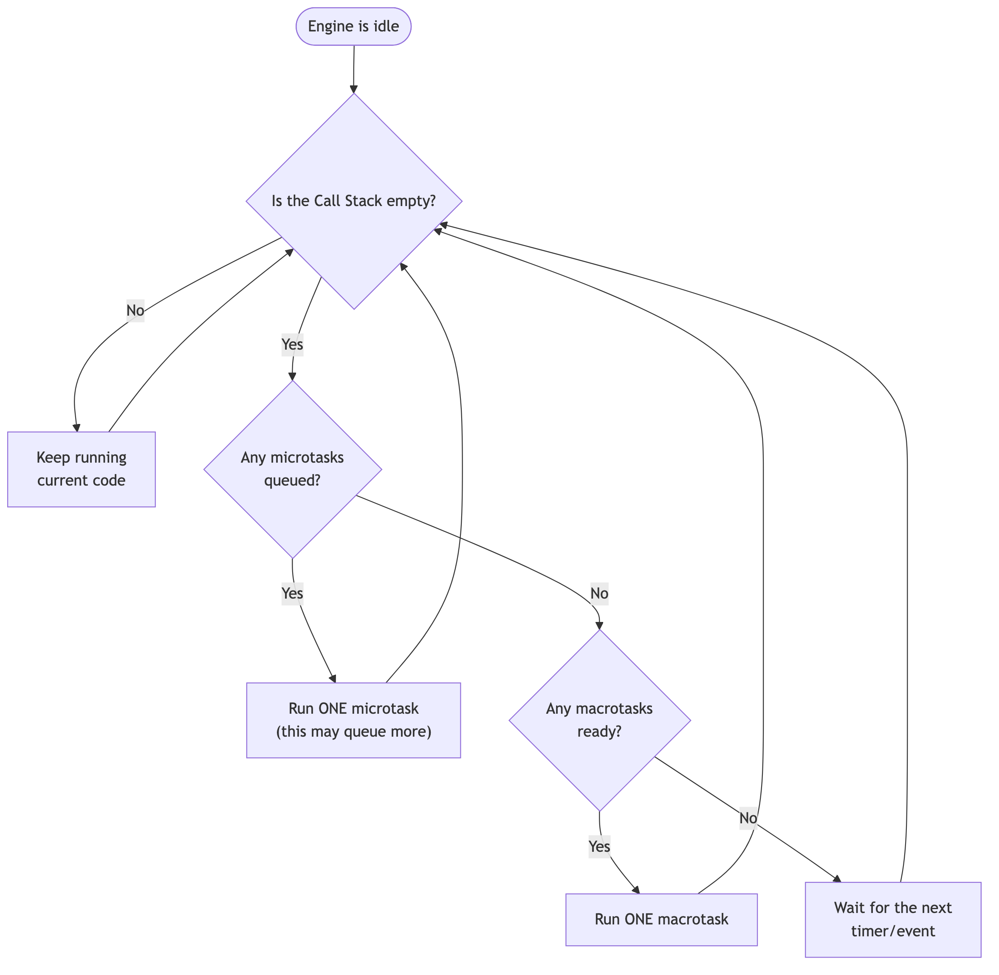

<div align="center">

# EventLoop Studio

**Watch your own JavaScript actually run: call stack, heap, timers, microtasks, and the event loop, one step at a time.**


[](https://github.com/JACOBIAN01/EventLoop-Studio/issues)

</div>

---

## Creator

Built by **Subhadeep Ghorai**, an SDE and Instructor at Newton School of Technology. This extension grew out of watching the same event loop confusion come up again and again while teaching, and deciding it deserved something you can actually run and watch instead of just a diagram.

Made for JavaScript developers, students, and anyone preparing for an interview who wants to *see* why a `setTimeout` runs after three promises they were sure would go last.

**Portfolio:** [subhadeep-ghorai.vercel.app](https://subhadeep-ghorai.vercel.app)

---

`console.log` order in your terminal rarely matches the order you expected while writing the code. EventLoop Studio answers "why did that run in that order" by actually executing your `.js` file in a sandboxed environment, recording every call-stack push/pop, timer registration, and promise scheduling event, then replaying that recording as a step-by-step diagram next to your source.

It is not a canned animation of a textbook example. It runs the file you have open.

---

## Table of Contents

- [Overview](#overview)
- [Core Features](#core-features)
- [Installation](#installation)
- [Quick Start](#quick-start)
- [Usage](#usage)
- [Commands](#commands)
- [Configuration](#configuration)
- [Technical Behavior](#technical-behavior)
- [Privacy \& Security](#privacy--security)
- [Compatibility \& Requirements](#compatibility--requirements)
- [Troubleshooting](#troubleshooting)
- [Limitations](#limitations)
- [Architecture: How It Works](#architecture-how-it-works)
- [Development](#development)
- [Support](#support)
- [Changelog](#changelog)
- [License](#license)

---

## Overview

**Problem:** Explaining the JavaScript event loop with static diagrams or a single canned example doesn't transfer to a learner's own code. Generic browser-based visualizers that re-simulate JS semantics from an AST break on recursion, closures, or real `async`/`await`, because they are reimplementing a JS interpreter rather than running one.

**Solution:** EventLoop Studio parses and instruments the active `.js` file, executes it for real inside a Node [`vm`](https://nodejs.org/api/vm.html) sandbox, and records an ordered trace of every call-stack push/pop, console call, and timer/microtask/phase transition. The trace is replayed in a VS Code webview as an interactive, scrubbable diagram synchronized to source lines.

**Target users:**
- Students and bootcamp learners meeting the event loop for the first time.
- Developers debugging an ordering bug in a real file, without adding throwaway `console.log` calls.
- Interview candidates reviewing `setTimeout`/Promise ordering before a JS-fundamentals round.

**Primary workflow:** open a `.js` file, run **Visualize Event Loop**, step or play through the recorded trace, read the synchronized source-line highlight and narration.

What distinguishes this from a diagram: the Heap panel re-snapshots variable values at every statement boundary (not just at declaration), timer state (Web APIs → Macrotask Queue → Call Stack) is tracked as an explicit per-item fact rather than inferred from call-stack contents, and Node mode's Poll phase dispatches a genuinely real `fs.readFile` to Node's actual libuv thread pool instead of a simulated delay.

---

## Core Features

| Feature | Developer benefit | How it works |
|---|---|---|
| **Real execution, not simulation** | Recursion, closures, real `async`/`await`, and edge cases like variable shadowing all behave correctly | The active file runs inside a Node `vm` context with its own `Promise` intrinsics; nothing is reverse-engineered from the AST |
| **Step-by-step replay with scrubbing** | Jump to any point in execution and get a correct panel state, not just play forward | Every panel's state at a given step is a pure fold over `steps[0..index]`; nothing is mutated incrementally |
| **Live Heap panel** | See a variable's value change across reassignments and async callbacks, not just its value at declaration | Every tracked binding and parameter is re-snapshotted at each statement boundary and function exit |
| **Call Stack with real registration frames** | See `process.nextTick(...)`, `setTimeout(...)`, `.then()`, etc. as the real synchronous calls they are, distinct from the callback they queue | Each registration call gets a brief push/pop frame before its callback is queued |
| **Callback identification in every queue** | Tell two pending `setTimeout(fn, 0)` calls apart by their actual code, not a generic label | Each queue token and phase-chip preview shows the callback's own source, truncated with a hover tooltip for the full text |
| **Node.js mode** | See the real six libuv phases (Timers, Pending Callbacks, Idle/Prepare, Poll, Check, Close Callbacks) in their fixed order, plus a central Microtask Hub for `process.nextTick`/Promises | A ring diagram with a single "you are here" pointer; Poll is a genuinely real `fs.readFile` raced against other pending reads |
| **EventLoop Guide narration** | Understand *why* a step happened, not just that it happened | Deterministic, hand-written captions in two tiers: rule-level (always visible) and mechanical (toggle-able) |
| **Resizable, persisted layout** | Give more room to whichever panel matters for the file you're debugging | Every split uses `react-resizable-panels`; sizes persist via `vscodeApi.setState()` |
| **Auto-refresh on save** | Edit the file and see the update without closing/reopening the panel or re-running the command | Saving the visualized file re-records automatically; a save that fails to parse keeps showing the last working trace with a small warning instead of blanking the panel |
| **Show Parsed AST (JSON)** | Inspect how the parser sees your file, independent of execution | Standalone command producing a flat JSON summary of variables, functions, calls, timers, and promise usage |

---

## Installation

### Option 1: `.vsix` file (current distribution method)

This extension is not yet listed on the VS Code Marketplace. Install the packaged `.vsix` directly:

```bash
code --install-extension eventloop-studio-0.3.1.vsix
```

Or, from within VS Code:

1. Open the Command Palette (`Ctrl+Shift+P` / `Cmd+Shift+P`).
2. Run **Extensions: Install from VSIX...**
3. Select the `eventloop-studio-0.3.1.vsix` file.
4. Reload the window if VS Code doesn't prompt automatically.

### Option 2: VS Code Marketplace

`[TODO: add Marketplace listing URL once eventloop-studio is published]`

### Requirements

| Requirement | Value |
|---|---|
| VS Code version | `^1.85.0` or later |
| Operating system | No OS-specific code paths; no native/binary dependencies |
| Runtime dependencies | None to install separately — `acorn`, `acorn-walk`, `react`, `framer-motion`, `react-resizable-panels` are bundled into `out/` at build time |
| Reload after install/update | Yes, standard for any VS Code extension install |

---

## Quick Start

```text
1. Open any .js file in VS Code (or one of the bundled samples/*.js files).
2. Click the "Visualize Event Loop" icon in the editor title bar,
   or run "EventLoop Studio: Visualize Event Loop" from the Command Palette.
3. A panel opens beside your editor, paused at the first step.
4. Click "Next" a few times, or hit "Play".
5. Watch the highlighted source line and the Call Stack / queue panels
   update together, and read the caption at the bottom for the "why."
```

<!-- SCREENSHOT: Editor title bar with the Visualize Event Loop toolbar icon highlighted -->

Concrete example — open `samples/01-classic-ordering.js` and run **Visualize Event Loop**. You'll see `console.log` calls land on the Call Stack immediately, a `Promise.then()` callback queue into the Microtask Queue, and a `setTimeout` callback travel from Web APIs into the Macrotask Queue only after the microtask queue is empty.

<!-- SCREENSHOT: Visualize Event Loop panel showing Call Stack, Microtask Queue, and Macrotask Queue mid-replay -->

---

## Usage

### Workflow: Diagnose an unexpected console.log order

**Goal:** find out why output order doesn't match source order.

**Steps:**
1. Open the file producing the unexpected output.
2. Run **Visualize Event Loop**.
3. Compare the **Console** panel's order against the **Event Loop** panel's phase indicator at each step.
4. Scrub backward to the last point before the divergence.

**Result:** the exact step where a microtask or macrotask ran ahead of (or behind) expectation, with a caption explaining the rule that produced it.

<!-- SCREENSHOT: Console panel next to Event Loop panel mid-divergence -->

### Workflow: Compare Browser vs. Node.js event loop models

**Goal:** understand how `setImmediate`, `process.nextTick`, and I/O phases differ from the browser model.

**Steps:**
1. Open a file using Node-only APIs (see `samples/node-event.js` or the built-in globals listed in [Technical Behavior](#technical-behavior)).
2. Run **Visualize Event Loop**; it opens in Node.js mode automatically when Node-only APIs are detected, or toggle the Browser/Node.js switch manually.
3. Step through and watch the ring diagram's "you are here" pointer move through the six libuv phases.

**Result:** the Microtask Hub flashes between phases exactly as often as it actually drains, and the Check phase visibly re-drains a `setImmediate` scheduled from inside another one, in the same pass.

<!-- SCREENSHOT: Node.js mode ring diagram with an active phase highlighted -->

### Workflow: Inspect the parsed structure of a file

**Goal:** see what the parser found without running the file.

**Steps:**
1. Open a `.js` file.
2. Run **EventLoop Studio: Show Parsed AST (JSON)** from the Command Palette.

**Result:** a JSON document listing variables, functions, calls, `console.log` sites, timers, and promise usage.

---

## Commands

| Command ID | Title | Where it appears |
|---|---|---|
| `eventloop-studio.visualize` | Visualize Event Loop | Command Palette; editor title-bar icon (JavaScript files only) |
| `eventloop-studio.showAstSummary` | Show Parsed AST (JSON) | Command Palette |

No default keybindings are registered for either command.

---

## Configuration

EventLoop Studio has no `contributes.configuration` entries in `package.json` — there are no user or workspace settings to configure. Two preferences exist but are stored as webview UI state (not VS Code settings), and persist automatically without any action needed:

- EventLoop Guide narration on/off
- Light/Dark theme selection
- Panel layout sizes (resettable via the in-panel "Reset Layout" button)

These are not exposed under `Settings` because they apply only within the visualization panel itself.

---

## Technical Behavior

- **Activation:** `activationEvents` is empty; both commands activate the extension implicitly via VS Code's command-contribution activation, so there is no idle background activity before you invoke a command.
- **Execution model:** the active file's source is parsed with [acorn](https://github.com/acornjs/acorn), instrumented via character-position splicing (not AST-to-source regeneration), and run inside a Node `vm` context that is a genuinely separate realm from the extension host.
- **Faked vs. real APIs:** `setTimeout`, `process.nextTick`, `setImmediate`, `simulateSystemCallback`, and `createHandle` are faked as in-memory queues (no real waiting). `Promise`, `async`/`await` execute with the real, native, spec-correct engine behavior. `readFileReal` (Node mode) dispatches a genuinely real `fs.readFile` to Node's actual libuv thread pool.
- **File access:** the sandbox reads only the file you actively run **Visualize Event Loop** or **Show Parsed AST** against. `readFileReal` in the sample Node scripts reads that same active file, not arbitrary filesystem paths.
- **Workspace interaction:** no files are written, no workspace configuration is modified, no other open editors are touched.
- **Background processes:** none persist after a trace finishes recording; the panel is inert until you run a command again.
- **Data flow:** source text → extension host (parse, instrument, execute, record) → one `Trace` object posted once to the webview → all further interaction (stepping, scrubbing, resizing) happens client-side in the webview with no further host round-trips per step.

---

## Privacy & Security

- **No telemetry.** No usage analytics, crash reporting, or metrics are collected or transmitted, verified by inspection of the extension's source (no telemetry/analytics libraries or calls are present).
- **No network requests.** The extension does not call any external API or service. The one "genuinely real" operation (Node mode's Poll phase) is a local `fs.readFile` dispatched to Node's local libuv thread pool — it never leaves the machine.
- **No authentication or credentials.** The extension requires no sign-in, API key, or token.
- **Local-only processing.** Your source file is read from disk, executed inside a local Node `vm` sandbox in the extension host process, and never leaves your machine.

---

## Compatibility & Requirements

| Item | Value |
|---|---|
| VS Code | `^1.85.0` |
| Operating systems | Windows, macOS, Linux — no platform-specific code or native modules |
| Target language | JavaScript (`.js`) files. The editor-title toolbar icon only appears when `resourceLangId == javascript` |
| Node/runtime dependencies for the packaged extension | None beyond what VS Code itself provides — all dependencies are bundled into `out/` |
| TypeScript / JSX / other languages | Not supported by the parser/instrumenter; a `.ts` or `.jsx` file will fail to parse |

---

## Troubleshooting

### Problem: The "Visualize Event Loop" icon doesn't appear in the editor title bar

**Cause:** the icon is scoped to `resourceLangId == javascript`; it only shows for files VS Code recognizes as JavaScript.

**Solution:**
```text
Use the Command Palette instead: "EventLoop Studio: Visualize Event Loop"
Or confirm the file's language mode (bottom-right status bar) is set to "JavaScript"
```

### Problem: "Could not parse this file as JavaScript"

**Cause:** the file contains a syntax error, or uses syntax the bundled acorn parser version doesn't support (e.g. very new stage-3 proposals), or is not actually JavaScript (e.g. TypeScript-only syntax).

**Solution:**
```text
Run the file directly with `node <file>.js` first to confirm it's valid, executable JavaScript
```

### Problem: A Node-only API (e.g. `process`, `setImmediate`) throws inside the sandbox in Browser mode

**Cause:** Browser mode intentionally does not expose Node-only globals.

**Solution:**
```text
Toggle the mode switch at the top of the panel to "Node.js" before re-running
```

### Problem: The recorded trace looks truncated or incomplete

**Cause:** the recorder caps total steps and macrotask/phase iterations as a safety limit against runaway loops (e.g. `setInterval` with no exit condition).

**Solution:**
```text
Check for an unconditional timer/interval loop in the script and add a stopping condition
```

### Problem: The panel doesn't update after editing the file

**Cause:** the panel auto-refreshes on save, so unsaved edits (or an editor with autosave off) won't show up until you save. If a small red warning dot appears next to the filename, your last save didn't parse — the panel is intentionally still showing the previous working version, not that save.

**Solution:**
```text
Save the file (Ctrl/Cmd+S), or click "Update" in the Source panel header to preview
unsaved edits immediately without saving
```

---

## Limitations

- **Shadowed variables share one Heap slot.** The Heap panel is a flat, name-keyed view; an inner-scope variable that shadows an outer one shows whichever was most recently touched, not both independently.
- **Async function stack-frame depth is a pedagogical approximation.** Instrumentation marks function-body boundaries, not individual `await` suspension points, so a frame can appear to stay open slightly longer than the real engine would show. Console output and event ordering remain exactly correct.
- **Line highlighting is one level into function bodies.** Deeply nested blocks (e.g. inside a loop) don't get independent line markers; the highlight reflects the nearest tracked statement.
- **`worker_threads` are not modeled** in Node.js mode. This would require a second Call Stack/Heap lane and cross-thread trace merging.
- **`setTimeout(fn, 0)` vs. `setImmediate` ordering at the very top level of a script is resolved one consistent way, and flagged as such rather than presented as a rule.** This specific race is genuinely undocumented in real Node too, and depends on process startup overhead (inside an I/O callback, `setImmediate` always and correctly wins, no ambiguity there). When it occurs, the step's caption and a hover tooltip on the Timers phase chip explain that a real terminal run can legitimately show the opposite order.
- **No automated test suite yet** covering the recorder's ordering guarantees (tracked in the roadmap).
- **Single-file only.** `import`/`require`-linked multi-file execution is not modeled; the sandbox runs exactly one file's source.

---

## Architecture: How It Works

```text
Source file (.js)
   |
   v
acorn parser  ->  AST
   |
   v
Instrumentor (character-position splicing)
   |
   v
Node vm sandbox (real Promise/async, faked timers)
   |
   v
Ordered ExecutionStep[] trace
   |
   v
Webview (React) — pure fold over steps[0..index] per rendered step
```

### The recording pipeline



1. **Parse** the source with acorn.
2. **Instrument** every function body with `enter()`/`exit()` trace calls and Heap re-snapshot calls at statement boundaries and function exits.
3. **Execute** the instrumented source inside a Node `vm` context with its own `Promise` intrinsics.
4. **Record** every push/pop, console call, and scheduling event as one `ExecutionStep`.
5. **Replay**: the trace is sent to the webview once; every panel's state at any step is derived by a pure fold over `steps[0..index]`.

### Sequence: clicking Visualize



### The event loop's decision procedure



After a microtask runs, the loop re-checks the Call Stack and Microtask Queue before ever moving to the next macrotask — a microtask that schedules another microtask keeps winning ahead of any pending timer.

### Project structure

```text
EventLoop Studio/
├── src/                          Extension host (Node.js side)
│   ├── extension.ts               Activation + command registration
│   ├── panel/EventLoopPanel.ts    Webview lifecycle, HTML/CSP, message routing
│   ├── parser/astSummary.ts       Standalone AST -> JSON summary
│   ├── recorder/
│   │   ├── instrument.ts          Source-splicing instrumentation engine
│   │   └── sandbox.ts             vm sandbox, monkey-patched APIs, driver loop
│   └── shared/types.ts            ExecutionStep / Trace contract shared with the webview
│
├── webview-ui/                   React application rendered inside the webview
│   ├── src/App.tsx                 Layout + computeStateAtStep (core derivation logic)
│   ├── src/components/             One component per panel
│   ├── src/lib/captions.ts         Two-tier narration templates
│   └── src/state/                  Playback + resizable-layout state
│
├── samples/                      Example scripts (see below)
├── media/                        Extension icon, toolbar icons, README diagrams
├── esbuild.js                    Build script
└── package.json                  Extension manifest
```

### Sample scripts

| File | What it exercises |
|---|---|
| `01-classic-ordering.js` | Sync → microtask → macrotask ordering |
| `02-nested-promises.js` | Microtasks that queue more microtasks mid-drain |
| `03-async-await.js` | How `async`/`await` desugars to promise scheduling |
| `04-recursion-and-closures.js` | Call stack depth under recursion, closure capture |
| `05-event-loop-challenge.js`, `06-event-loop-challenge.js` | Denser mixes: shadowing, `this` binding, interleaved timers/microtasks |
| `07-heap.js` | Reference vs. value semantics |
| `node-event.js` | Node mode: `process.nextTick`, `setTimeout`, `setImmediate`, nested scheduling |

---

## Development

```bash
# Install dependencies
npm install

# Type-check + bundle (extension host and webview)
npm run compile

# Rebuild on file change
npm run watch

# Type-check only
npm run typecheck

# Package a .vsix (requires @vscode/vsce, available via npx)
npx vsce package
```

Debugging: open this repository in VS Code and press `F5` to launch an Extension Development Host with the extension loaded.

This project's [LICENSE](#license) does not grant permission to modify, merge, or redistribute the source. External pull requests are not solicited; bug reports and feature suggestions are welcome via GitHub Issues.

---

## Support

- **Issues / bug reports:** [github.com/JACOBIAN01/EventLoop-Studio/issues](https://github.com/JACOBIAN01/EventLoop-Studio/issues)
- **Repository:** [github.com/JACOBIAN01/EventLoop-Studio](https://github.com/JACOBIAN01/EventLoop-Studio)
- **Homepage / README:** [github.com/JACOBIAN01/EventLoop-Studio#readme](https://github.com/JACOBIAN01/EventLoop-Studio#readme)

---

## Changelog

Full history in [CHANGELOG.md](CHANGELOG.md). Recent highlights:

**0.3.2**
- Added: the panel auto-refreshes when you save the visualized file, plus a manual "Update" button in the Source panel for previewing unsaved edits on demand.
- Changed: Light/Dark is now a single sun/moon toggle; the playback speed selector animates between speeds; Node mode's default layout fits all 6 phase chips without horizontal scrolling; the Close Callbacks -> Timers return path is one connected line instead of 3 disconnected arrowheads.

**0.3.1**
- Fixed: the top-level `setTimeout(fn, 0)` vs. `setImmediate` race is now flagged as ambiguous in the caption and a dedicated phase-chip tooltip, instead of silently resolved as if it were a rule.

**0.3.0**
- Added: registration calls (`process.nextTick`, `setTimeout`, `setImmediate`, `queueMicrotask`, `.then()`/`.catch()`/`.finally()`) now appear on the Call Stack as their own brief frame.
- Added: queue tokens and phase-chip previews show the callback's real source, with a hover tooltip for the full, untruncated code.
- Added: the Microtask Hub's nextTick/Promise split is resizable.
- Changed: Node mode's Pending Timers panel merged into the ring's first phase chip.
- Fixed: tooltip clipping in Call Stack/Heap/phase chips; Source panel highlight bar on long scrolled lines; phase-chip badge clipping.

**0.2.0**
- Added: Node.js event loop mode (all six libuv phases, a real `fs.readFile`-backed Poll phase, correct same-pass nested `setImmediate` draining, central Microtask Hub).
- Added: Light/Dark theme; resizable panels with layout persistence and reset.

---

## License

Proprietary — all rights reserved. See [LICENSE](LICENSE). The source is publicly viewable for portfolio and evaluation purposes only; copying, modifying, or redistributing it requires prior written permission from the copyright holder.
