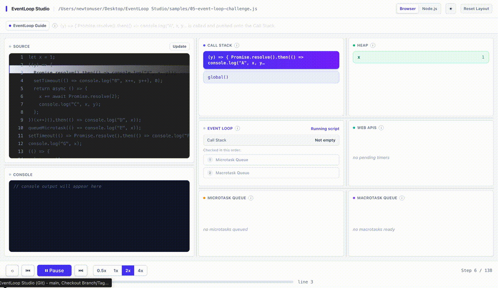
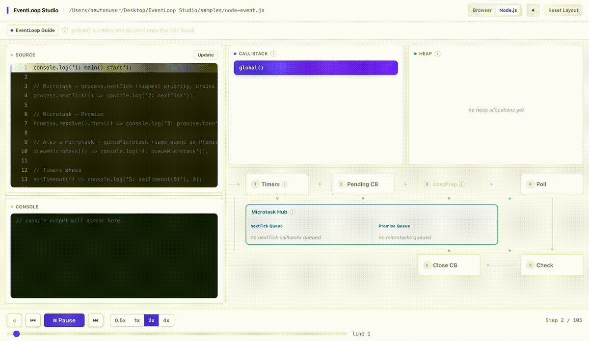

<div align="center">

# EventLoop Studio

**Visualize JavaScript execution inside VS Code: Call Stack, Heap, Microtasks, Timers, and the
event loop, one step at a time.**

Run your code. Don't simulate it.


[](https://marketplace.visualstudio.com/items?itemName=SubhadeepGhorai.eventloop-studio)
[](https://marketplace.visualstudio.com/items?itemName=SubhadeepGhorai.eventloop-studio)

[](https://github.com/JACOBIAN01/EventLoop-Studio/issues)

<p><b>Browser mode</b><br></p>

<p><b>Node.js mode</b><br></p>

</div>

---

## What is EventLoop Studio?

EventLoop Studio is a VS Code extension that answers "why did that run in that order?" by
actually executing your `.js` file inside a Node [`vm`](https://nodejs.org/api/vm.html)
sandbox, and recording every call-stack push/pop, console call, and timer/microtask/phase
transition as it genuinely happens. That recording replays next to your source as an
interactive, scrubbable diagram: Call Stack, Heap, Web APIs, Microtask Queue, Macrotask Queue,
and Console in Browser mode; the six real libuv phases and a central Microtask Hub in Node.js
mode.

## Why EventLoop Studio?

Most event-loop visualizers are a fixed animation of one canned example. They teach the concept
in the abstract, then leave you to map it onto your own, different code by hand.

| | Traditional visualizers | EventLoop Studio |
|---|---|---|
| Input | A canned example baked into the tool | Your own open `.js` file |
| Semantics | Re-simulated from an AST | Genuinely executed in a Node `vm` sandbox |
| Recursion, closures, real `async`/`await` | Often break or are approximated | Behave correctly, since the real engine runs them |
| Replay | Fixed animation | Scrubbable, step-by-step, synchronized to source |
| Event loop model | Usually browser-only | Browser and Node.js (six libuv phases) |

## See It in Action

### Browser Mode


Open `samples/01-classic-ordering.js` and run **Visualize Event Loop**. `console.log` calls land
on the Call Stack immediately, the `Promise.then()` callback queues into the Microtask Queue, and
the `setTimeout` callback moves from Web APIs into the Macrotask Queue only once the microtask
queue is empty.

### Node.js Mode


Open `samples/node-event.js` (or toggle the switch manually) to watch the "you are here" pointer
move through Timers, Pending Callbacks, Idle/Prepare, Poll, Check, and Close Callbacks, with the
Microtask Hub draining `process.nextTick` and Promise callbacks between every phase transition.


## Key Features

- **Real execution, not simulation.** The active file runs inside a Node `vm` context with its
  own `Promise` intrinsics, so recursion, closures, real `async`/`await`, and edge cases like
  variable shadowing all behave correctly; nothing is reverse-engineered from the AST.
- **Step-by-step replay with scrubbing.** Jump to any point in the trace and every panel reflects
  the correct state at that step, not just wherever forward playback happened to leave it.
- **Live Heap panel.** Variables and function parameters are re-snapshotted at every statement
  boundary and function exit, so reassignments show up, not just the value at declaration.
- **Call Stack with real registration frames.** `process.nextTick(...)`, `setTimeout(...)`,
  `.then()`, and friends get a brief real frame for the registration call itself, distinct from
  the callback they queue.
- **Callback identification in every queue.** Two pending `setTimeout(fn, 0)` calls are
  distinguishable by their actual code, truncated inline, with a hover tooltip for the full text.
- **Node.js mode.** The real six libuv phases in their fixed order, plus a central Microtask Hub
  for `process.nextTick`/Promises, drawn as a ring with a single "you are here" pointer.
- **EventLoop Guide narration.** Deterministic captions explain *why* a step happened, in two
  tiers: rule-level (always visible) and mechanical (toggleable).
- **Resizable, persisted layout.** Every panel split can be dragged; sizes persist across reloads,
  with a one-click "Reset Layout."
- **Auto-refresh on save.** Editing the visualized file and saving re-records automatically; a
  save that fails to parse keeps showing the last working trace with a small warning dot, instead
  of blanking the panel.
- **Show Parsed AST (JSON).** Inspect how the parser sees a file (variables, functions, calls,
  timers, promise usage), independent of execution.

## Installation

**From the Marketplace:** search **EventLoop Studio** in the Extensions view (`Ctrl+Shift+X` /
`Cmd+Shift+X`) and click **Install**, or visit
[marketplace.visualstudio.com/items?itemName=SubhadeepGhorai.eventloop-studio](https://marketplace.visualstudio.com/items?itemName=SubhadeepGhorai.eventloop-studio).

**From a `.vsix` file** (a specific release build instead of whatever's currently live):

```bash
code --install-extension eventloop-studio-0.3.4.vsix
```

Or via the Command Palette: run **Extensions: Install from VSIX...** and select the file.

## Quick Start

```js
// quick-start.js
console.log('start');

setTimeout(() => console.log('timeout'), 0);

Promise.resolve().then(() => console.log('promise'));

console.log('end');
```

```text
1. Open this file (or any .js file, or one of the bundled samples/*.js files) in VS Code.
2. Click the "Visualize Event Loop" icon in the editor title bar,
   or run "EventLoop Studio: Visualize Event Loop" from the Command Palette.
3. A panel opens beside your editor, paused at the first step.
4. Click "Next" a few times, or hit "Play".
5. Watch the highlighted source line and the Call Stack / queue panels update
   together, and read the caption at the bottom for the "why."
```

No configuration is required before your first visualization.

## What Can You Visualize?

**JavaScript execution**
- Function calls, recursion, and closures on a real Call Stack
- Variable and parameter values on a live Heap panel, re-snapshotted on every reassignment
- Synchronized source-line highlighting as execution proceeds

**Async execution**
- `Promise` chains, including `.then()`/`.catch()`/`.finally()`, with real, spec-correct
  microtask ordering
- `async`/`await`
- `queueMicrotask`
- `setTimeout(fn, delay)` / `clearTimeout`, modeled as an in-memory macrotask queue

**Node.js mode only**
- `process.nextTick`
- `setImmediate`, including same-pass nested draining
- The six libuv phases: Timers, Pending Callbacks, Idle/Prepare, Poll, Check, Close Callbacks
- `readFileReal(...)`: a genuinely real `fs.readFile` dispatched to Node's actual libuv thread
  pool, so completion order in the Poll phase reflects what the thread pool actually did
- `simulateSystemCallback(...)` and `createHandle(...).close(...)`: modeled deferred callbacks
  for the Pending Callbacks and Close Callbacks phases

## Browser vs Node.js

| | Browser mode | Node.js mode |
|---|---|---|
| Call Stack, Heap, source sync | ✓ | ✓ |
| Promises, `async`/`await`, `queueMicrotask` | ✓ | ✓ |
| `setTimeout` / `clearTimeout` | ✓ | ✓ |
| `process.nextTick` | ✗ | ✓ |
| `setImmediate` | ✗ | ✓ |
| Event loop model | Single macrotask queue | Six real libuv phases + Microtask Hub |
| Real (non-simulated) I/O | ✗ | ✓ (`readFileReal`, Poll phase) |
| Auto-detected | Default mode | Auto-selected when Node-only APIs are detected, or toggle manually |

## Who Is It For?

- **Students and bootcamp learners** meeting the event loop for the first time, who need to see
  it happen rather than read about it.
- **JavaScript developers** debugging an ordering bug in a real file, without adding throwaway
  `console.log` calls.
- **Node.js developers** who need to reason about `process.nextTick`, `setImmediate`, and libuv
  phase ordering specifically, not just the simplified browser model.
- **Interview candidates** reviewing `setTimeout`/Promise ordering before a JS-fundamentals round.

## Privacy & Security

- **No telemetry.** No usage analytics, crash reporting, or metrics are collected or transmitted:
  there are no telemetry or analytics libraries or calls anywhere in the source.
- **No network requests.** The extension never calls an external API or service. The one
  genuinely real operation (Node mode's Poll phase) is a local `fs.readFile` dispatched to Node's
  local libuv thread pool; it never leaves the machine.
- **No authentication.** No sign-in, API key, or token is required.
- **Local-only processing.** Your source file is read from disk and executed inside a local Node
  `vm` context in the extension host process; it never leaves your machine.
- **What the `vm` sandbox is, and isn't.** The `vm` context isolates execution into its own
  realm so recorded traces don't leak into or interfere with the extension host's own globals;
  it is an *execution isolation boundary for the visualization*, not a hardened security boundary
  for running untrusted code. Treat it the way you'd treat running any script you open with
  `node`: fine for your own files and the bundled samples, not a sandbox for code you don't trust.

## Requirements

| Requirement | Value |
|---|---|
| VS Code version | `^1.85.0` or later |
| Operating system | Windows, macOS, Linux (no OS-specific code paths or native modules) |
| Target language | JavaScript (`.js`) files |
| TypeScript / JSX | Not supported: the bundled acorn parser will fail to parse `.ts`/`.jsx` syntax |
| Runtime dependencies | None to install separately (`acorn`, `acorn-walk`, `react`, `framer-motion`, `react-resizable-panels` are bundled into `out/` at build time) |
| Network / account | None required |
| Telemetry | None collected |

## Execution Model

```text
Source file (.js)
   |
   v
acorn parser  ->  AST
   |
   v
Instrumentor (character-position splicing)
   |
   v
Node vm sandbox (real Promise/async, faked timers)
   |
   v
Ordered ExecutionStep[] trace
   |
   v
Webview (React): pure fold over steps[0..index] per rendered step
```

Every behavior in a trace falls into one of three categories:

| Category | Meaning | Examples |
|---|---|---|
| **Real** | Genuinely executed by the engine, no shortcuts | `Promise`/`async`/`await` run on the vm context's own native `Promise`, which shares the process's real microtask queue, giving spec-correct ordering "for free"; `readFileReal` dispatches an actual `fs.readFile` to Node's real libuv thread pool, raced with `Promise.race` so completion order is whatever the thread pool actually produced |
| **Instrumented** | Real code, observed via inserted trace calls | Every function body is wrapped with `__trace.enter`/`exit` calls (character-position splicing into the source, not AST-to-source regeneration) so real calls, including recursive ones, push/pop a genuine Call Stack frame; variables are re-snapshotted to the Heap at each statement boundary |
| **Simulated** | Intentionally modeled as an in-memory queue, not real waiting | `setTimeout`, `process.nextTick`, `setImmediate`, `simulateSystemCallback`, and `createHandle(...).close()` are faked as controlled in-memory queues; a real timer would force the recorder to wait out real delays just to produce a trace |

## Limitations

- **The top-level `setTimeout(fn, 0)` vs. `setImmediate` race is flagged, not hidden.** This is
  the one genuinely undocumented ordering in real Node itself: at the very top level of a script,
  which one runs first depends on real machine timing at process startup, not a fixed rule
  (inside an I/O callback, `setImmediate` always and correctly wins, no ambiguity there). When
  this exact race occurs, the step's caption and the EventLoop Guide's own tooltip call it out
  directly, instead of presenting one arbitrary resolution as if it were a rule.
- **Async function stack-frame depth is a pedagogical approximation.** Instrumentation marks
  function-body boundaries, not individual `await` suspension points, so a frame can appear to
  stay open slightly longer than the real engine would show. Console output and event ordering
  remain exactly correct.
- **Shadowed variables share one Heap slot.** The Heap panel is a flat, name-keyed view; an
  inner-scope variable shadowing an outer one shows whichever was most recently touched, not both
  independently.
- **Single-file only.** The sandbox runs exactly one file's source; `import`/`require`-linked
  multi-file execution is not modeled, and `require` itself is never exposed.
- **`worker_threads` are not modeled** in Node.js mode.
- **Line highlighting is one level into function bodies.** Deeply nested blocks (e.g. inside a
  loop) don't get independent line markers; the highlight reflects the nearest tracked statement.

## Commands

| Command ID | Title | Where it appears |
|---|---|---|
| `eventloop-studio.visualize` | Visualize Event Loop | Command Palette; editor title-bar icon (JavaScript files only) |
| `eventloop-studio.showAstSummary` | Show Parsed AST (JSON) | Command Palette |

No default keybindings are registered for either command. There are no `contributes.configuration`
settings: the EventLoop Guide toggle, theme, and panel layout are webview UI state that persists
automatically, with a "Reset Layout" button for the panel sizes.

## Troubleshooting

**Problem:** The "Visualize Event Loop" icon doesn't appear in the editor title bar.
**Cause:** the icon only shows when `resourceLangId == javascript`.
**Solution:** run "EventLoop Studio: Visualize Event Loop" from the Command Palette instead, or
confirm the file's language mode (bottom-right status bar) is set to "JavaScript."

**Problem:** "Could not parse this file as JavaScript."
**Cause:** a syntax error, unsupported syntax (e.g. very new stage-3 proposals), or the file isn't
actually JavaScript (e.g. TypeScript-only syntax).
**Solution:** run `node <file>.js` directly first to confirm it's valid, executable JavaScript.

**Problem:** A Node-only API (e.g. `process`, `setImmediate`) throws inside the sandbox.
**Cause:** Browser mode intentionally doesn't expose Node-only globals.
**Solution:** toggle the mode switch at the top of the panel to "Node.js" and re-run.

**Problem:** The recorded trace looks truncated or incomplete.
**Cause:** the recorder caps total steps and phase/macrotask iterations as a safety limit against
runaway loops (e.g. an unconditional `setInterval`).
**Solution:** check for an unconditional timer/interval loop and add a stopping condition.

**Problem:** The panel doesn't update after editing the file.
**Cause:** the panel auto-refreshes on save; unsaved edits won't show up until you save. A small
red warning dot next to the filename means the last save didn't parse, and the panel is
intentionally still showing the previous working trace.
**Solution:** save the file (`Ctrl`/`Cmd+S`), or click "Update" in the Source panel header to
preview unsaved edits without saving.

## Under the Hood

### The recording pipeline


The source is parsed with acorn; every function body is instrumented with `enter()`/`exit()`
trace calls and Heap re-snapshot calls at statement boundaries and function exits; the
instrumented source runs inside a Node `vm` context with its own `Promise` intrinsics; every
push/pop, console call, and scheduling event is recorded as one `ExecutionStep`; the full trace
is sent to the webview once, where every panel's state at any step is derived by a pure fold over
`steps[0..index]`.

### Sequence: clicking Visualize


### The event loop's decision procedure


After a microtask runs, the loop re-checks the Call Stack and Microtask Queue before ever moving
to the next macrotask: a microtask that schedules another microtask keeps winning ahead of any
pending timer.

### Project structure

```text
EventLoop Studio/
├── src/                          Extension host (Node.js side)
│   ├── extension.ts               Activation + command registration
│   ├── panel/EventLoopPanel.ts    Webview lifecycle, HTML/CSP, message routing
│   ├── parser/astSummary.ts       Standalone AST -> JSON summary
│   ├── recorder/
│   │   ├── instrument.ts          Source-splicing instrumentation engine
│   │   └── sandbox.ts             vm sandbox, monkey-patched APIs, driver loop
│   └── shared/types.ts            ExecutionStep / Trace contract shared with the webview
│
├── webview-ui/                   React application rendered inside the webview
│   ├── src/App.tsx                 Layout + computeStateAtStep (core derivation logic)
│   ├── src/components/             One component per panel
│   ├── src/lib/captions.ts         Two-tier narration templates
│   └── src/state/                  Playback + resizable-layout state
│
├── samples/                      Example scripts (see below)
├── media/                        Extension icon, toolbar icons, README diagrams
├── esbuild.js                    Build script
└── package.json                  Extension manifest
```

### Sample scripts

| File | What it exercises |
|---|---|
| `01-classic-ordering.js` | Sync → microtask → macrotask ordering |
| `02-nested-promises.js` | Microtasks that queue more microtasks mid-drain |
| `03-async-await.js` | How `async`/`await` desugars to promise scheduling |
| `04-recursion-and-closures.js` | Call stack depth under recursion, closure capture |
| `05-event-loop-challenge.js`, `06-event-loop-challenge.js` | Denser mixes: shadowing, `this` binding, interleaved timers/microtasks |
| `07-heap.js` | Reference vs. value semantics |
| `node-event.js` | Node mode: `process.nextTick`, `setTimeout`, `setImmediate`, nested scheduling |

## Development

```bash
# Install dependencies
npm install

# Type-check + bundle (extension host and webview)
npm run compile

# Rebuild on file change
npm run watch

# Type-check only
npm run typecheck

# Package a .vsix (requires @vscode/vsce, available via npx)
npx vsce package
```

Debugging: open this repository in VS Code and press `F5` to launch an Extension Development
Host with the extension loaded.

This project's [license](#license) does not grant permission to modify, merge, or redistribute
the source. External pull requests are not solicited; bug reports and feature suggestions are
welcome via GitHub Issues.

## Support

- **Issues / bug reports:** [github.com/JACOBIAN01/EventLoop-Studio/issues](https://github.com/JACOBIAN01/EventLoop-Studio/issues)
- **Repository:** [github.com/JACOBIAN01/EventLoop-Studio](https://github.com/JACOBIAN01/EventLoop-Studio)
- **Homepage / README:** [github.com/JACOBIAN01/EventLoop-Studio#readme](https://github.com/JACOBIAN01/EventLoop-Studio#readme)

## What's New

**0.3.4**: Rewrote the README to a more structured, professionally documented format, including
an Execution Model section classifying every behavior as Real / Instrumented / Simulated;
compressed both demo GIFs for faster loading (77%/69% smaller, no loss in color fidelity).

Full history in [CHANGELOG.md](CHANGELOG.md).

## License

Proprietary. All rights reserved. See [LICENSE](LICENSE). The source is publicly viewable for
portfolio and evaluation purposes only; copying, modifying, or redistributing it requires prior
written permission from the copyright holder.

---

<div align="center">

## Creator

Built by **Subhadeep Ghorai**, SDE and Instructor at Newton School of Technology. This extension
grew out of watching the same event loop confusion come up again and again while teaching, and
deciding it deserved something you can actually run and watch instead of just a diagram.

Made for JavaScript developers, students, and anyone preparing for an interview who wants to
*see* why a `setTimeout` runs after three promises they were sure would go last.

</div>
